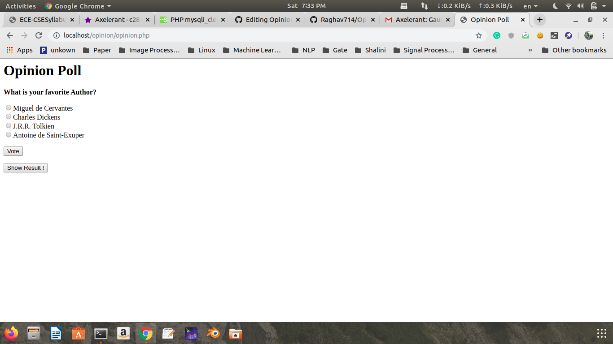

# Opinion-poll
## Install and Enable Apache2, PHP, MySQL
$ sudo apt update && upgrade 
$ sudo apt install apache2 
$ sudo apt install php libapache2-mod-php php-mysql 
## Technology Used
PHP, MySQL and JavaScript
## Creating Database 
create database poll;
## Creating Table
create table author_poll ( `id` int(11) NOT NULL AUTO_INCREMENT, `choice` tinyint(4) NOT NULL DEFAULT '0', `ts` timestamp NULL DEFAULT NULL, PRIMARY KEY (`id`));
## Screenshots

